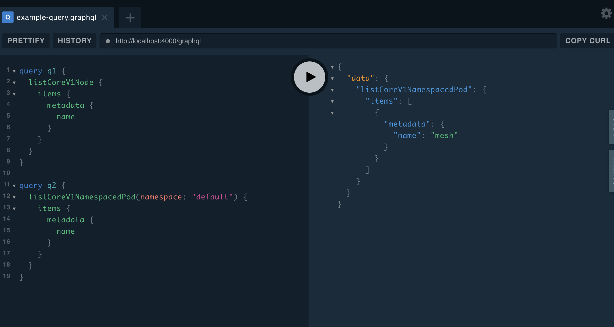
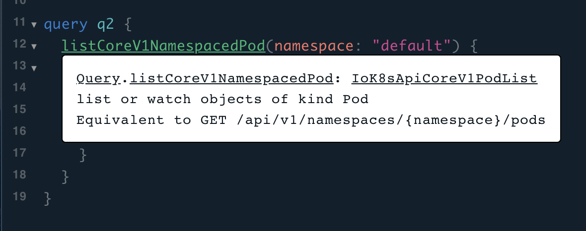
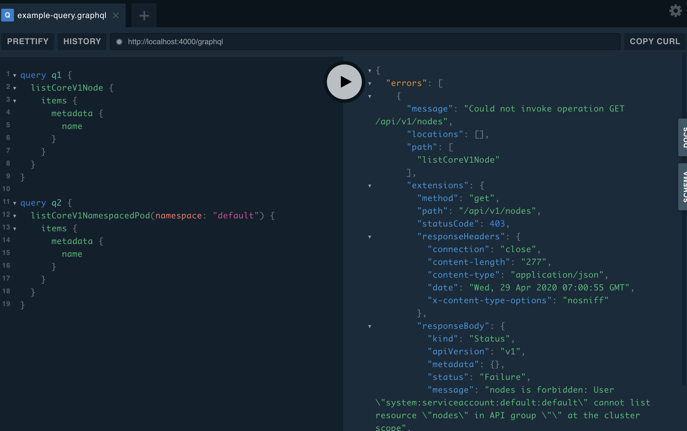

# GraphQL endpoint of Kubernetes API; dynamically created by GraphQL Mesh

Simple setup for converting Kubernetes API server into GraphQL API.

This sample exposes GraphQL endpoint by using only API management tool [GraphQL Mesh](https://github.com/Urigo/graphql-mesh).


- [GraphQL endpoint of Kubernetes API; dynamically created by GraphQL Mesh](#graphql-endpoint-of-kubernetes-api-dynamically-created-by-graphql-mesh)
- [Advantage of GraphQL](#advantage-of-graphql)
- [Query example](#query-example)
  - [Example 1. list pods](#example-1-list-pods)
  - [Example 2: get pods with labels](#example-2-get-pods-with-labels)
  - [Example 3. `parent`/`children` and `connected`/`connecting`](#example-3-parentchildren-and-connectedconnecting)
  - [Example 4. Helper and error case](#example-4-helper-and-error-case)
- [Start up](#start-up)
  - [Prerequisites](#prerequisites)
  - [Case 1: with Kubernetes](#case-1-with-kubernetes)
  - [Case 2 : with Helm](#case-2--with-helm)
- [Cleanup](#cleanup)
- [Architecture](#architecture)
- [Customize](#customize)
- [Reference](#reference)
  - [Similar projects](#similar-projects)

# Advantage of GraphQL

- Unique and readable query format
  - In GraphQL world, you edit fields in your query so that response data will include only fields that you need.
- Completion or validation of query
  - When you edit your query with GraphQL playground or Graphiql, they have powerful completion function which enables you to easily construct query without remembering exact field name etc.

# Query example

  ## Example 1. list pods


  ```sh
  kubectl get pods --namespace default -o jsonpath='{range .items[*]}{.metadata.name}{"\t"}{.status.startTime}{"\n"}{end}'
  ```

  ```graphql
  {
    listCoreV1NamespacedPod(namespace: "default") {
      items {
        metadata {
          name
        }
        status {
          startTime
        }
      }
    }
  }
  ```

  Example: Pod listing

  

  ## Example 2: get pods with labels

  ```sh
  kubectl get pods --namespace default -l run=mesh -o jsonpath='{range .items[*]}{.metadata.name}{"\t"}{.metadata.namespace}{"\t"}{.metadata.labels}{"\t"}{.status.startTime}{"\n"}{end}'
  ```

  ```graphql
  {
  	listCoreV1NamespacedPod(
      namespace: "default", 
      labelSelector: "run=mesh"
    ) {
      items {
        metadata {
          name
          namespace
          labels
        }
        status {
          startTime
        }
      }
    }
  }
  ```

  ## Example 3. `parent`/`children` and `connected`/`connecting`

  These are original fields.

  ```graphql
  query q {
    listCoreV1NamespacedPod(namespace: "default") {
      items {
        # All pods in default namespace
        metadata {
          name
          namespace
          ownerReferences {
            name
          }
          labels
        }
        parent { # ReplicaSet
          parent { # Deployment
            metadata {
              name
            }
          }
          children { # Pods
            metadata {
              name
            }
          }
        }
        connected { # Services
          metadata {
            name
          }
        }
      }
    }
  }
  ```

  | Name | Value | Example |
  |-|-|-|
  | `parent` | Follow a owner link which means dependency in Kubernetes  | `Pod.parent` -> `ReplicaSet`, `ReplicaSet.parent` -> `Deployment` |
  | `children` | Drill down owner links downward. Search for all child resource elements which has owner link to original resource. | `Deployment.children` -> `[ReplicaSet]`, `ReplicaSet.children` -> `[Pod]`|
  | `connecting` | Search for all resource elements which have the same labels as `la belSelector` of original resource.  | `Service.connecting` -> `[Pod]` |
  | `connected` | Search for resources whose `labelSelector` includes all labels of original resource | `Pod.conntected` -> `Service` |

  ## Example 4. Helper and error case

  Example: document generated according to OpenAPI

  

  Error case

  

# Start up

## Prerequisites

You have your own Kubernetes cluster or create one. For example, you can create it with the following command after installing [kind](https://kind.sigs.k8s.io/docs/user/quick-start/).

```sh
# Create a Kubernetes cluster on Docker
kind create cluster --name kube-graphql --config kind-config.yaml
```

## Case 1: with Kubernetes


```sh
# Run containers on Kubernetes. 
kubectl apply -f k8s -n default

# Forward GraphQL Mesh to local machine
kubectl port-forward svc/mesh-svc 4000:4000 -n default
```

Access `http://localhost:4000`.

## Case 2 : with Helm

After installing helm command, you can deploy [helm chart](https://onelittlenightmusic.github.io/graphql-mesh-docker/helm-chart).

```sh
helm repo add kubernetes-graphql https://onelittlenightmusic.github.io/kubernetes-graphql/helm-chart
helm install my-kubernetes-graphql kubernetes-graphql/kubernetes-graphql
# or with parameter
helm install my-kubernetes-graphql kubernetes-graphql/kubernetes-graphql --set kubernetes-api-proxy.serviceAccount.clusterWide=true
```

Access a URL which is displayed after running `helm install` (e.g. `http://graphql-mesh-k8s.127.0.0.1.xip.io`).

Helm chart parameters are as follows,

  | Name | Description | Default |
  |-|-|-|
  | `kubernetes-api-proxy.serviceAccount.create` | If `true`, ServiceAccount will be created for GraphQL API | `true` |
  | `kubernetes-api-proxy.serviceAccount.clusterWide` | If `true`, GraphQL API endpoint will be allowed to call cluster wide API like `kubectl get nodes` | `false` |
  | `graphql-mesh.ingress.enabled` | If `true`, an Ingress will be created. In this case, you prepare Ingress Controller. | `true` |


# Cleanup

```sh
kubectl delete -f k8s
```

# Architecture

```
Pod
- pod: mesh
  - container: mesh (#1: GraphQL endpoint. runs GraphQL Mesh to convert #2 API to GraphQL)
  - container: proxy (#2: REST API endpoint. runs kubectl proxy to forward request to #4)

Service
- mesh-rc (#3: endpoint of GraphQL Mesh, connected to #1 and #2)
- kubernetes (#4: Automatically generated by Kubernetes. Kubernetes API endpoint)
```

# Customize

Edit resources in `src` directory

```sh
src
├── .meshrc.yaml # Configuration file for GraphQL Mesh
├── example-query.graphql # Initial query to be shown in GraphQL Playground
└── mesh-init.sh # Initialization script for OpenAPI specification of Kubernetes
```

Compile into `k8s/meshrc-cm.yaml` with this command.

```sh
kubectl create cm meshrc-cm --from-file src/.meshrc.yaml --from-file src/mesh-init.sh --from-file src/example-query.graphql  --dry-run -o yaml> k8s/meshrc-cm.yaml
```

# Reference

- [GraphQL Mesh](https://github.com/Urigo/graphql-mesh)
- [GraphQL Mesh OpenAPI sample](https://github.com/Urigo/graphql-mesh/tree/master/examples/openapi-javascript-wiki)
- [Kubernetes OpenAPI specification](https://github.com/kubernetes/kubernetes/tree/master/api/openapi-spec)
- [GraphQL Mesh Docker](https://github.com/onelittlenightmusic/graphql-mesh-docker)

## Similar projects 

These are some existing orignal tools for the same motivation.

- [qlkube](https://github.com/qlkube/qlkube)
- [kubiql](https://github.com/yipeeio/kubeiql)