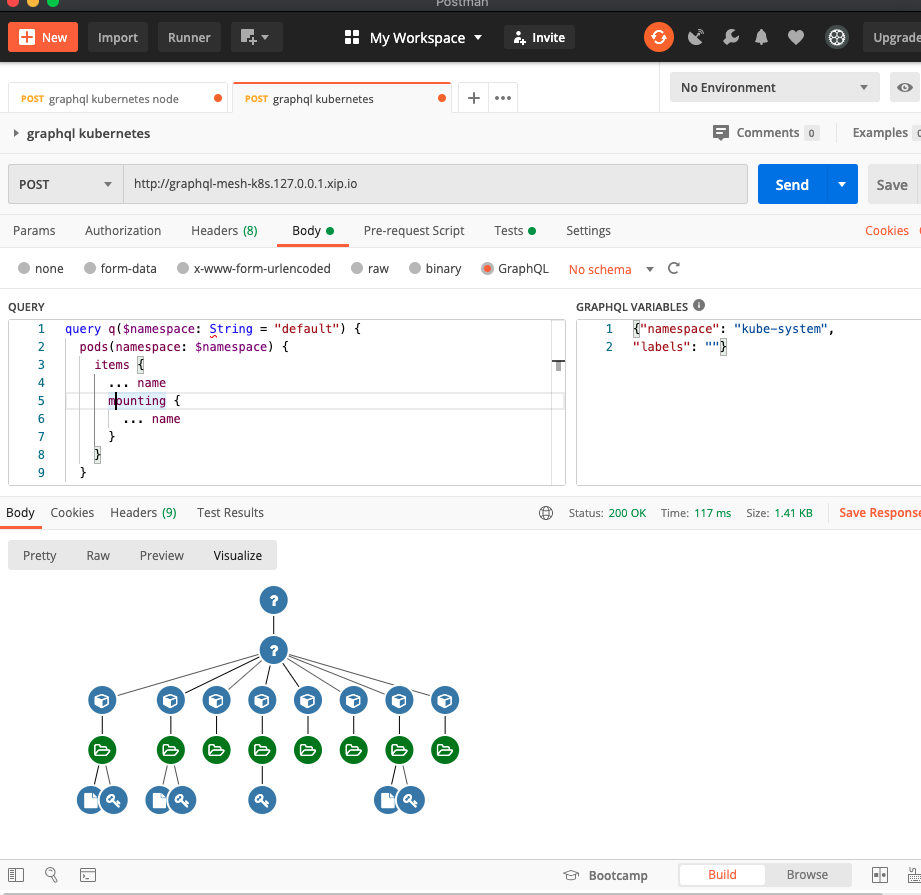
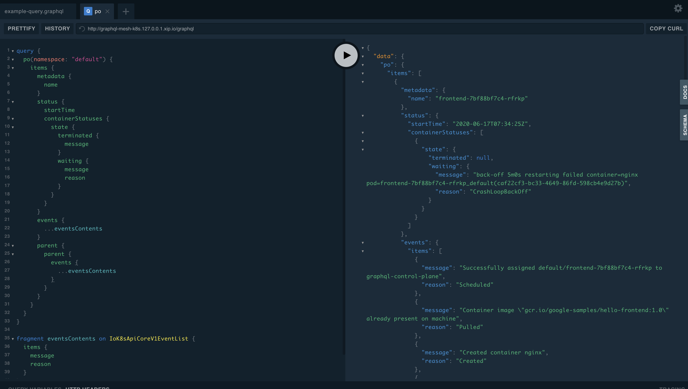

# GraphQL endpoint of Kubernetes API & Docker; dynamically created by GraphQL Mesh

Simple setup for converting Kubernetes API server into GraphQL API.

This sample exposes GraphQL endpoint by using only API management tool [GraphQL Mesh](https://github.com/Urigo/graphql-mesh).


- [GraphQL endpoint of Kubernetes API & Docker; dynamically created by GraphQL Mesh](#graphql-endpoint-of-kubernetes-api--docker-dynamically-created-by-graphql-mesh)
- [Advantage of GraphQL](#advantage-of-graphql)
  - [Query. list pods](#query-list-pods)
  - [Interactive visualiation by Postman](#interactive-visualiation-by-postman)
- [Query example (Kubernetes)](#query-example-kubernetes)
  - [Example 2: get pods with labels](#example-2-get-pods-with-labels)
  - [Example 2-2. get single pod with name](#example-2-2-get-single-pod-with-name)
  - [Example 3-1. `parent`/`children`, `connected`/`connecting`](#example-3-1-parentchildren-connectedconnecting)
  - [Example 3-2. Debugging with `events`](#example-3-2-debugging-with-events)
  - [Example 4. Helper and error case](#example-4-helper-and-error-case)
- [Query example (docker)](#query-example-docker)
  - [Example 1. Show volume list](#example-1-show-volume-list)
  - [Example 2. Show container list](#example-2-show-container-list)
- [Start up](#start-up)
  - [Prerequisites](#prerequisites)
  - [Case 1: with Kubernetes](#case-1-with-kubernetes)
  - [Case 2 : with Helm](#case-2--with-helm)
  - [Case 3 : Docker](#case-3--docker)
- [Cleanup](#cleanup)
- [Kubernetes Query](#kubernetes-query)
- [Original resolvers (`parent/children`, `connecting/connected`, `mounting`, `namespace` and `events`)](#original-resolvers-parentchildren-connectingconnected-mounting-namespace-and-events)
- [Architecture](#architecture)
  - [In Kubernetes](#in-kubernetes)
  - [Docker](#docker)
- [Customize](#customize)
- [Reference](#reference)
  - [Similar projects](#similar-projects)

# Advantage of GraphQL

- Unique and readable query format
  - In GraphQL world, you edit fields in your query so that response data will include only fields that you need.
- Completion or validation of query
  - When you edit your query with GraphQL playground or Graphiql, they have powerful completion function which enables you to easily construct query without remembering exact field name etc.


  ## Query. list pods

  ```sh
  kubectl get pods --namespace default -o jsonpath='{range .items[*]}{.metadata.name}{"\t"}{.status.startTime}{"\n"}{end}'
  ```

  ```graphql
  {
    # pods or pos
    pods(namespace: "default") {
      items {
        metadata {
          name
        }
        status {
          startTime
        }
      }
    }
  }
  ```

  

  ## Interactive visualiation by Postman

  Resource relation is visualized as tree form. Please refer to [graphql-treeview](./graphql-greeview).

  

# Query example (Kubernetes)


  ## Example 2: get pods with labels

  ```sh
  kubectl get pods --namespace default -l run=mesh -o jsonpath='{range .items[*]}{.metadata.name}{"\t"}{.metadata.namespace}{"\t"}{.metadata.labels}{"\t"}{.status.startTime}{"\n"}{end}'
  ```

  ```graphql
  {
    # pods or pos
  	pods(
      namespace: "default", 
      labelSelector: "run=mesh"
    ) {
      items {
        metadata {
          name
          namespace
          labels
        }
        status {
          startTime
        }
      }
    }
  }
  ```

  ## Example 2-2. get single pod with name

  ```graphql
  {
    # pod or po
    pod(
      name: "mesh"
      namespace: "default", 
    ) {
      metadata {
        name
        namespace
      }
    }
  }
  ```

  ## Example 3-1. `parent`/`children`, `connected`/`connecting`

  These are original fields. Please refer to [Original resolvers](#original-resolvers).

  ```graphql
  query q {
    pods(namespace: "default") {
      items {
        metadata {
          name
        }
        parent {
          # ReplicaSets (Pod's parent)
          ... on ReplicaSet {
            metadata {
              name
            }
            children {
              # Pods (ReplicaSet's children)
              items {
                metadata {
                  name
                }
              }
            }
          }
        }
        connected {
          # Services (Pod's connected resources)
          items {
            metadata {
              name
            }
            connecting {
              # Pods (Service's connecting targets)
              items {
                metadata {
                  name
                }
              }
            }
          }
        }
      }
    }
  }

  ```

  ## Example 3-2. Debugging with `events`
  
  This is useful for Pod debugging.

  ```sh
  kubectl get po; (check...) kubectl get deployment; (check...) kubectl get events ...
  ```

  This query replaces many operations of `kubectl`.

  ```graphql
  query {
    pods(namespace: "default") { # Pod
      items {
        metadata {
          name
        }
        status {
          startTime
          containerStatuses {
            state {
              terminated {
                message
              }
              waiting {
                message
                reason
              }
            }
          }
        }
        events { # Get events list related to Pod
          ...eventsContents   
        }
        parent { # ReplicaSet or DaemonSet or StatefulSet (if any exists)
          ...on ReplicaSet { # Deployment (if any exists)
            events { # Get events for the above grandparent resources. 
              ...eventsContents
            }
          }
        }
      }
    }
  }

  fragment eventsContents on EventList {
    items {
      message
      reason
    }
  }
  ```

  

  ## Example 4. Helper and error case

  Example: document generated according to OpenAPI

  

  Error case

  

# Query example (docker)

  ## Example 1. Show volume list

  ```graphql
  query q {
    volumeList {
      volumes {
        name
      }
    }
  }
  ```

  ## Example 2. Show container list

  ```graphql
  query q {
    containerList{
      names
      ports {
        privatePort
        publicPort
      }
    }
  }
  ```

  

# Start up

## Prerequisites

You have your own Kubernetes cluster or create one. For example, you can create it with the following command after installing [kind](https://kind.sigs.k8s.io/docs/user/quick-start/).

```sh
# Create a Kubernetes cluster on Docker
kind create cluster --name kube-graphql --config kind-config.yaml
```

## Case 1: with Kubernetes

```sh
# Run containers on Kubernetes. 
kubectl apply -f k8s -n default
# When you need cluster wide resouce access (e.g. Namespace), you can run this command additionally.
kubectl apply -f k8s/cluster-wide/
```

If you have ingress controller in your cluster, you will see the service at `http://graphql-mesh-k8s.127.0.0.1.xip.io`.

Otherwise, this command allows you to forwarding port to localhost.

```
# Forward GraphQL Mesh to local machine
kubectl port-forward svc/mesh-svc 4000:4000 -n default
```

Access `http://localhost:4000`.

## Case 2 : with Helm

After installing helm command, you can deploy [helm chart](https://onelittlenightmusic.github.io/graphql-mesh-docker/helm-chart).

```sh
helm repo add kubernetes-graphql https://onelittlenightmusic.github.io/kubernetes-graphql/helm-chart
helm install my-kubernetes-graphql kubernetes-graphql/kubernetes-graphql
# or with parameter
helm install my-kubernetes-graphql kubernetes-graphql/kubernetes-graphql --set kubernetes-api-proxy.serviceAccount.clusterWide=true
```

Access a URL which is displayed after running `helm install` (e.g. `http://graphql-mesh-k8s.127.0.0.1.xip.io`).

Helm chart parameters are as follows,

  | Name | Description | Default |
  |-|-|-|
  | `kubernetes-api-proxy.serviceAccount.create` | If `true`, ServiceAccount will be created for GraphQL API | `true` |
  | `kubernetes-api-proxy.serviceAccount.clusterWide` | If `true`, GraphQL API endpoint will be allowed to call cluster wide API like `kubectl get nodes` | `false` |
  | `graphql-mesh.ingress.enabled` | If `true`, an Ingress will be created. In this case, you prepare Ingress Controller. | `true` |


  ## Case 3 : Docker

  Install `Docker` and `docker-compose` and run these commands.

  ```sh
  cd docker
  docker-compose up -d
  ```

# Cleanup

```sh
kubectl delete -f k8s
```

# Kubernetes Query

The query methods follow [Kubernetes Resource Type](https://kubernetes.io/docs/reference/kubectl/overview/#resource-types).

| Query | Abbreviations |
|-|-|
|          `nodes`|`no`|
|          `namespaces`|`ns`|
|          `clusterrolebindings`||
|          `clusterroles`||
|          `storageclasses`|`sc`|
|          `mutatingwebhookconfigurations`||
|          `validatingwebhookconfigurations`||
|          `certificatesigningrequests`|`csr`|
|          `podsecuritypolicies`|`psp`|
|          `componentstatuses`|`cs`|
|          `customresourcedefinitions`|`crd`|
|          `priorityclasses`|`pc`|
|          `csidrivers`||
|          `csinodes`||
|          `volumeattachments`||
|          `pods(namespace: String!) `|`po`|
|          `services(namespace: String!)`|`svc`|
|          `ingresses(namespace: String!)`|`ing`|
|          `replicasets(namespace: String!)`|`rs`|
|          `deployments(namespace: String!)`|`deploy`|
|          `daemonsets(namespace: String!)`|`ds`|
|          `statefulsets(namespace: String!)`|`sts`|
|          `replicationcontrollers(namespace: String!)`|`rc`|
|          `horizontalpodautoscalers(namespace: String!)`|`hpa`|
|          `cronjobs(namespace: String!)`|`cj`|
|          `jobs(namespace: String!)`||
|          `rolebindings(namespace: String!)`||
|          `roles(namespace: String!)`||
|          `serviceaccounts(namespace: String!)`|`sa`|
|          `resourcequotas(namespace: String!)`|`quota`|
|          `endpoints(namespace: String!)`|`ep`|
|          `controllerrevisions(namespace: String!)`|`cr`|
|          `networkpolicies(namespace: String!)`|`netpol`|
|          `poddisruptionbudgets(namespace: String!)`|`pdb`|
|          `limitranges(namespace: String!)`|`limits`|
|          `podtemplates(namespace: String!)`||
|          `events(namespace: String!)`|`ev`|
|          `persistentvolumeclaims(namespace: String!)`|`pvc`|
|          `persistentvolumes(namespace: String!)`|`pv`|
|          `secrets(namespace: String!)`||
|          `configmaps(namespace: String!)`|`cm`|

# Original resolvers (`parent/children`, `connecting/connected`, `mounting`, `namespace` and `events`)

There are some original resolvers inside some resource types. These are "links" from one resource to another. 

  | Name | Value | Example |
  |-|-|-|
  | `parent` | Follow a owner link which means dependency in Kubernetes  | `Pod.parent` -> `ReplicaSet`, `ReplicaSet.parent` -> `Deployment` |
  | `children` | Drill down owner links downward. Search for all child resource elements which has owner link to original resource. | `Deployment.children` -> `[ReplicaSet]`, `ReplicaSet.children` -> `[Pod]`|
  | `connecting` | Search for all resource elements which have the same labels as `la belSelector` of original resource.  | `Service.connecting` -> `[Pod]` |
  | `connected` | Search for resources whose `labelSelector` includes all labels of original resource | `Pod.conntected` -> `Service` |
  | `mounting` | Search for resources which are mounted as Volumes in the Pod | `Pod.mounting` -> `[Secret or ConfigMap or PersistentVolumeClaim]` |
  | `events` | Search for events related to the target resource | `Pod(and other resources).events` -> `[Event]` |
  | `namespace` | Direct link to namespace object | `Pod(and other resources).namespace` --> `Namespace` |

# Architecture

  ## In Kubernetes

  ```
  Pod
  - pod: mesh
    - container: mesh (#1: GraphQL endpoint. runs GraphQL Mesh to convert #2 API to GraphQL)
    - container: proxy (#2: REST API endpoint. runs kubectl proxy to forward request to #4)

  Service
  - mesh-rc (#3: endpoint of GraphQL Mesh, connected to #1 and #2)
  - kubernetes (#4: Automatically generated by Kubernetes. Kubernetes API endpoint)
  ```

  ## Docker

  ```
  Containers
  - container: proxy (REST API: transfer Docker unix-socket API to http port)
  - container: mesh-svc (GraphQL API: runs GraphQL Mesh to convert REST API to GraphQL)
  ```

# Customize

Edit resources in `src` directory

```sh
src
├── .meshrc.yaml # Configuration file for GraphQL Mesh
├── example-query.graphql # Initial query to be shown in GraphQL Playground
└── mesh-init.sh # Initialization script for OpenAPI specification of Kubernetes
```

Compile into `k8s/meshrc-cm.yaml` with this command.

```sh
kubectl create cm meshrc-cm --from-file src/.meshrc.yaml --from-file src/mesh-init.sh --from-file src/example-query.graphql  --dry-run -o yaml> k8s/meshrc-cm.yaml
```

# Reference

- [GraphQL Mesh](https://github.com/Urigo/graphql-mesh)
- [GraphQL Mesh OpenAPI sample](https://github.com/Urigo/graphql-mesh/tree/master/examples/openapi-javascript-wiki)
- [Kubernetes OpenAPI specification](https://github.com/kubernetes/kubernetes/tree/master/api/openapi-spec)
- [GraphQL Mesh Docker](https://github.com/onelittlenightmusic/graphql-mesh-docker)

## Similar projects 

These are some existing orignal tools for the same motivation.

- [qlkube](https://github.com/qlkube/qlkube)
- [kubiql](https://github.com/yipeeio/kubeiql)
